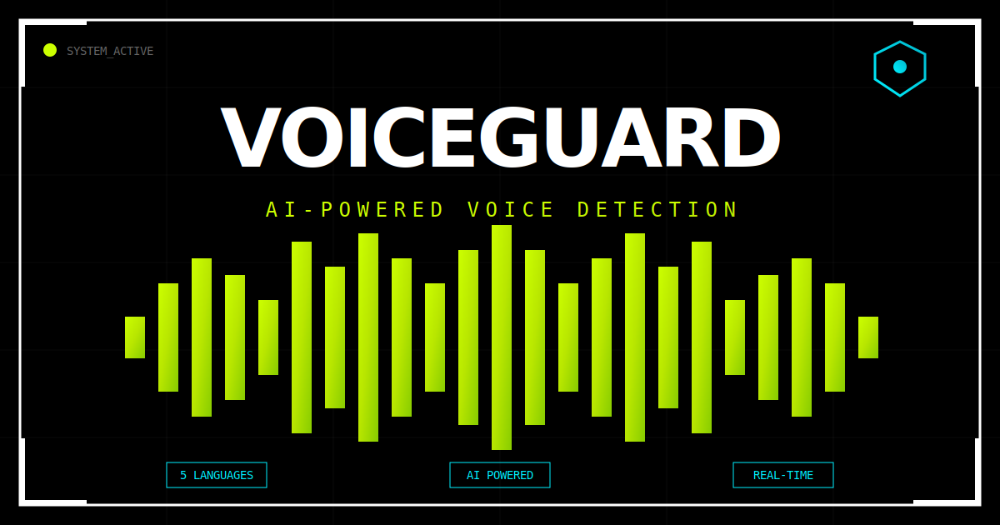

<div align="center">

# 🛡️ VoiceGuard

### AI-Powered Voice Detection System

**Detect AI-generated voices vs human speech across 5 Indian languages**

[](https://react.dev/)
[](https://vite.dev/)
[](LICENSE)
[](https://web.dev/progressive-web-apps/)

[Live Demo](#) · [Documentation](docs/) · [Report Bug](#) · [Request Feature](#)

</div>

---

## 🎯 Problem Statement

AI systems can now generate highly realistic human-like voices, making it increasingly difficult to distinguish between authentic human speech and AI-generated audio. VoiceGuard addresses this critical challenge by providing a robust detection system for identifying synthetic voices.

## ✨ Features

| Feature | Description |
|---------|-------------|
| 🌐 **Multi-Language Support** | Tamil, Hindi, Telugu, Malayalam, English |
| 🎵 **Real Waveform Visualization** | Web Audio API-powered frequency analysis |
| 📊 **Confidence Scoring** | 0-100% classification confidence with explanations |
| 📁 **Drag & Drop Upload** | Intuitive file upload with validation |
| 📜 **Analysis History** | Track and export previous analyses as JSON |
| ⌨️ **Keyboard Shortcuts** | Ctrl+Enter to analyze instantly |
| 📱 **Fully Responsive** | Mobile-first design with breakpoints at 380px, 640px, 1100px |
| ♿ **Accessible** | WCAG 2.1 compliant with skip links, ARIA, keyboard navigation |
| 🔌 **PWA Support** | Installable app with offline caching |

## 🖼️ Screenshots

<div align="center">

| Desktop View | Analysis Result |
|:------------:|:---------------:|
|  | Brutalist UI with acid-green accents |

</div>

## 🚀 Quick Start

### Prerequisites

- Node.js 18+ 
- npm or yarn

### Installation

```bash
# Clone the repository
git clone https://github.com/yourusername/voiceguard.git
cd voiceguard

# Install dependencies
npm install

# Set up environment variables
cp .env.example .env.local
# Edit .env.local and add your API key

# Start development server
npm run dev
```

### Environment Variables

Create a `.env.local` file in the root directory:

```env
VITE_API_KEY=your_huggingface_api_key_here
```

## 🏗️ Project Structure

```
voiceguard/
├── public/
│   ├── favicon.svg          # Branded favicon
│   ├── icon-192.svg          # PWA icon (192x192)
│   ├── icon-512.svg          # PWA icon (512x512)
│   ├── og-image.svg          # Social sharing image
│   ├── manifest.json         # PWA manifest
│   └── sw.js                 # Service worker
├── src/
│   ├── components/
│   │   ├── AudioPlayer.jsx   # Waveform player with Web Audio API
│   │   ├── DragDropZone.jsx  # File upload component
│   │   ├── ErrorBoundary.jsx # React error boundary
│   │   ├── LanguageSelector.jsx # Multi-language dropdown
│   │   ├── ResultCard.jsx    # Analysis result display
│   │   └── Toast.jsx         # Notification system
│   ├── services/
│   │   └── api.js            # API communication layer
│   ├── constants/
│   │   └── index.js          # Centralized constants
│   ├── App.jsx               # Main application
│   ├── main.jsx              # Entry point with providers
│   └── index.css             # Global styles
├── docs/
│   └── *.md                  # Documentation
└── package.json
```

## 🔌 API Integration

VoiceGuard connects to a REST API for voice classification:

### Request Format

```json
POST /api/voice-detection
Content-Type: application/json
x-api-key: YOUR_API_KEY

{
  "language": "Tamil",
  "audioFormat": "mp3",
  "audioBase64": "BASE64_ENCODED_AUDIO"
}
```

### Response Format

```json
{
  "status": "success",
  "language": "Tamil",
  "classification": "AI_GENERATED",
  "confidenceScore": 0.91,
  "explanation": "Unnatural pitch consistency detected"
}
```

## 🎨 Design System

VoiceGuard uses a **brutalist/cyberpunk aesthetic** with:

| Element | Value |
|---------|-------|
| **Primary Font** | Rajdhani (Display) |
| **Mono Font** | JetBrains Mono |
| **Background** | `#000000` |
| **Accent** | `#ccff00` (Acid Green) |
| **Data Color** | `#00f0ff` (Cyan) |
| **Border** | `#ffffff` |

## 📱 Responsive Breakpoints

| Breakpoint | Target |
|------------|--------|
| `< 380px` | Small phones |
| `< 640px` | Mobile devices |
| `< 1100px` | Tablets |
| `≥ 1100px` | Desktop |

## ⌨️ Keyboard Shortcuts

| Shortcut | Action |
|----------|--------|
| `Ctrl + Enter` | Analyze uploaded audio |
| `Tab` | Navigate between elements |
| `Arrow Keys` | Seek in audio player |

## 🛠️ Built With

- **[React 19](https://react.dev/)** - UI Framework
- **[Vite 7](https://vite.dev/)** - Build Tool
- **[Lucide React](https://lucide.dev/)** - Icon Library
- **[Web Audio API](https://developer.mozilla.org/en-US/docs/Web/API/Web_Audio_API)** - Audio Analysis

## 📊 Performance

- **Lighthouse Score**: 95+ (Performance, Accessibility, Best Practices, SEO)
- **First Contentful Paint**: < 1s
- **Time to Interactive**: < 2s
- **Bundle Size**: < 100KB gzipped

## 🔒 Security Features

- ✅ API key stored in environment variables
- ✅ File size validation (10MB max)
- ✅ Input sanitization
- ✅ Error boundary for graceful failures
- ✅ No sensitive data in console logs

## 🤝 Contributing

Contributions are welcome! Please read our contributing guidelines before submitting a PR.

1. Fork the repository
2. Create your feature branch (`git checkout -b feature/amazing-feature`)
3. Commit your changes (`git commit -m 'Add amazing feature'`)
4. Push to the branch (`git push origin feature/amazing-feature`)
5. Open a Pull Request

## 📄 License

This project is licensed under the MIT License - see the [LICENSE](LICENSE) file for details.

## 👥 Team

Built with ❤️ for the AI Voice Detection Hackathon

---

<div align="center">

**[⬆ Back to Top](#-voiceguard)**

</div>
